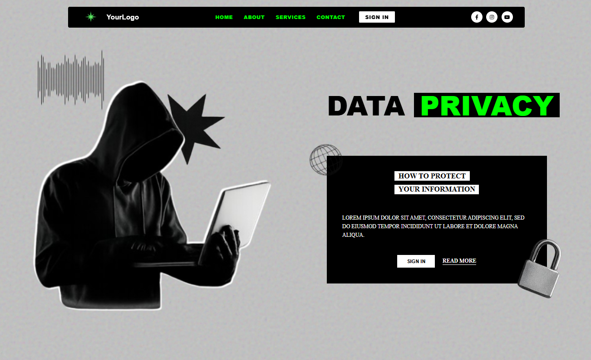

# Data Privacy - Cyber Security Landing Page

A modern, brutalist-style landing page dedicated to cyber security and data protection. This project features high-contrast visuals, a grainy texture background, and interactive parallax effects to create an immersive "hacker" aesthetic.



## 🚀 Features

* **Brutalist Design**: High-contrast black and neon green color palette with bold typography.
* **Interactive Parallax**: Dynamic mouse-move effects on hero elements (hacker silhuette, sphere, and stars).
* **Custom Textures**: SVG-based grain filter and overlay textures for a realistic paper-feel background.
* **Responsive Layout**: Optimized for high-resolution displays using CSS Flexbox and Absolute Positioning.
* **Smooth Navigation**: Functional "Read More" button with smooth scroll behavior.

## 🛠️ Tech Stack

* **HTML5**: Semantic structure.
* **SCSS (Sass)**: Modular styling with variables and nested hierarchies.
* **JavaScript (Vanilla)**: Lightweight scripts for mouse tracking and interactive UI.
* **Font Awesome**: For social media iconography.

## 📂 Project Structure

```text
Cyber-page/
├── assets/             # Images, icons, and textures
├── css/                # Compiled CSS files
├── js/                 # JavaScript logic
├── sass/               # Modular SCSS files (_hero.scss, _navbar.scss, etc.)
└── index.html          # Main entry point